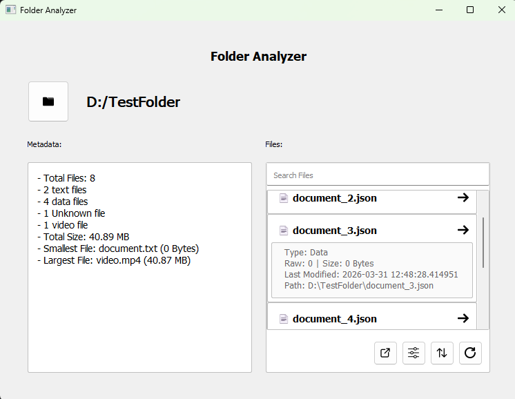

# Folder Analyzer

## 1. Description
A desktop application that lets users scan a directory and view file metadata, such as size, extension and last modified.

## 2. Features
- Selecting a directory
- View file metadata (size, name, extension, last modified)
- Analyze directory metadata (file count, file types, smallest/largest files)
- Filter files by type
- Sort files by name and size
- Export results (CSV, JSON, TXT)
- Restore previously selected directory

## 3. Screenshot

## 4. Tech Stack
- Python
- PyQt5

## 5. Download
[Download from my website](https://corporal1chicken.github.io/website/)

## 6. How to use
1. Select a directory
2. Click on the files in the right container to view its metadata
3. Apply filters or sort the data
4. Export to CSV, TXT or JSON
5. Select another directory
6. Revert back to the first directory using the reset button

## 7. What I learnt
- How to create UI with PyQt5
- Handling errors, such as file not found, invalid permissions and invalid directories
- Using one source of truth for filtering, sorting and exporting
- Separating UI and logic responsibilities, so the UI does not do everything

## 8. Future Improvements
- Dark mode
- Drag and drop directories
- Multiple analysis windows at once
- Custom filters based on what metadata there is